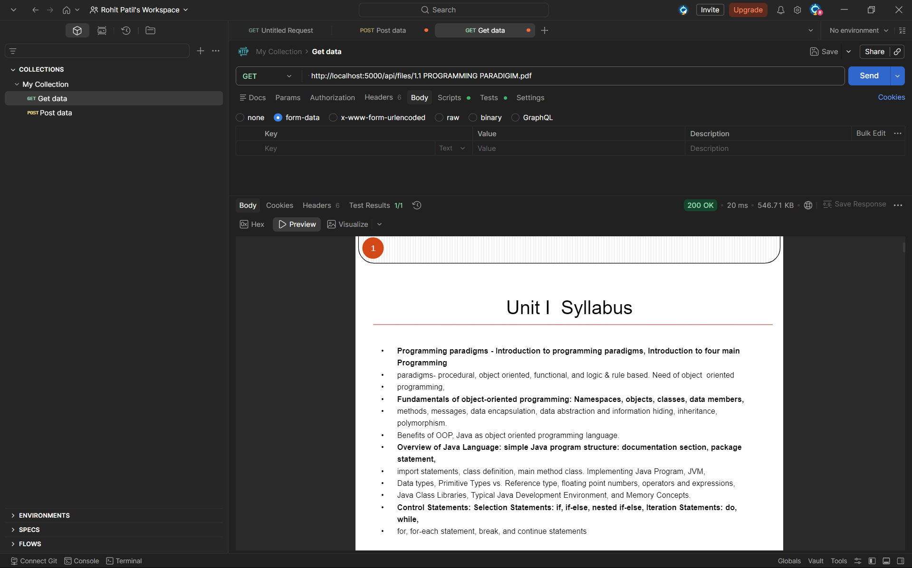
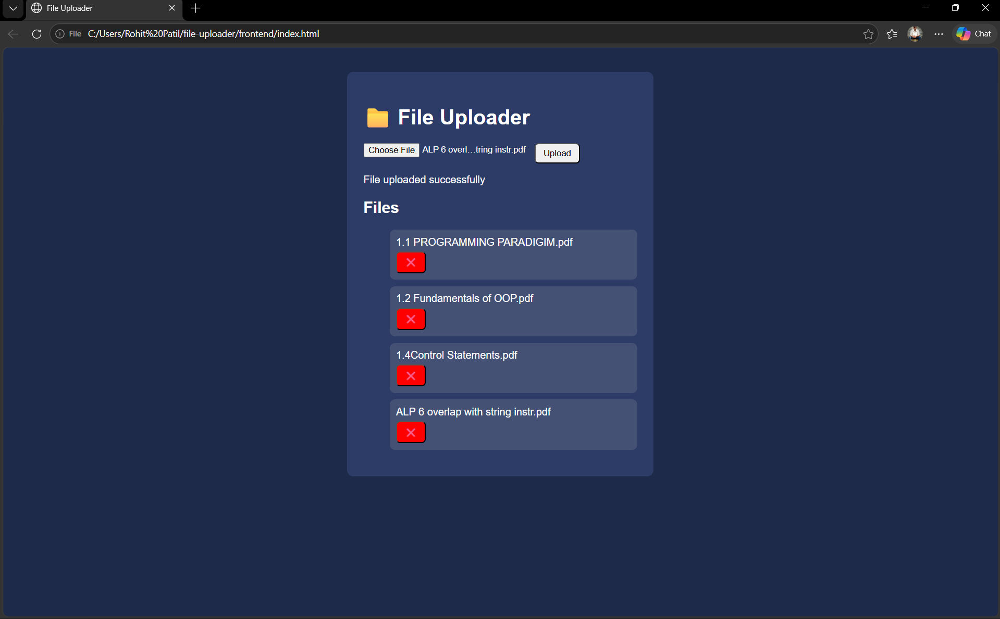
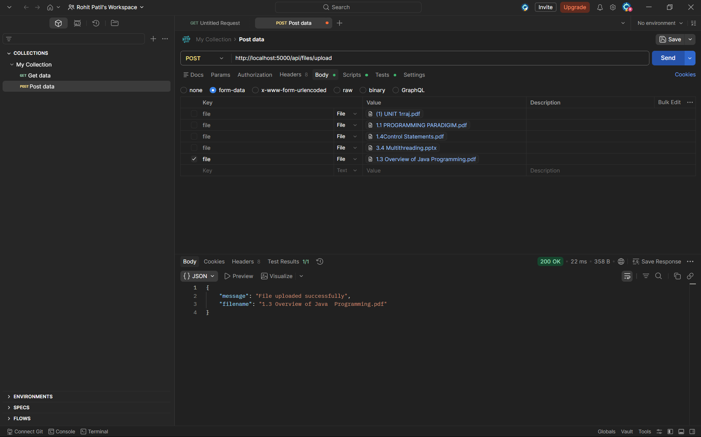

# 📁 File Uploader

A full-stack file upload system using:

- Node.js
- Express.js
- MongoDB (GridFS)
- Multer
- HTML, CSS, JavaScript

## 🚀 Features
- Upload files
- Store in MongoDB (GridFS)
- View uploaded files
- Delete files
- Simple UI

## 📸 MongoDB Storage (GridFS)

### Collections


### Files Data



## 🛠️ Run Project

```bash
npm install
node server.js